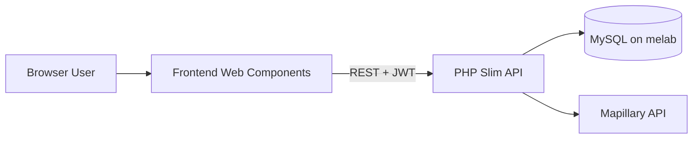
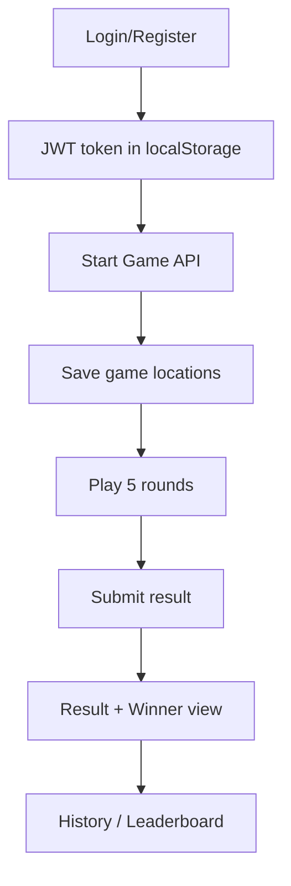
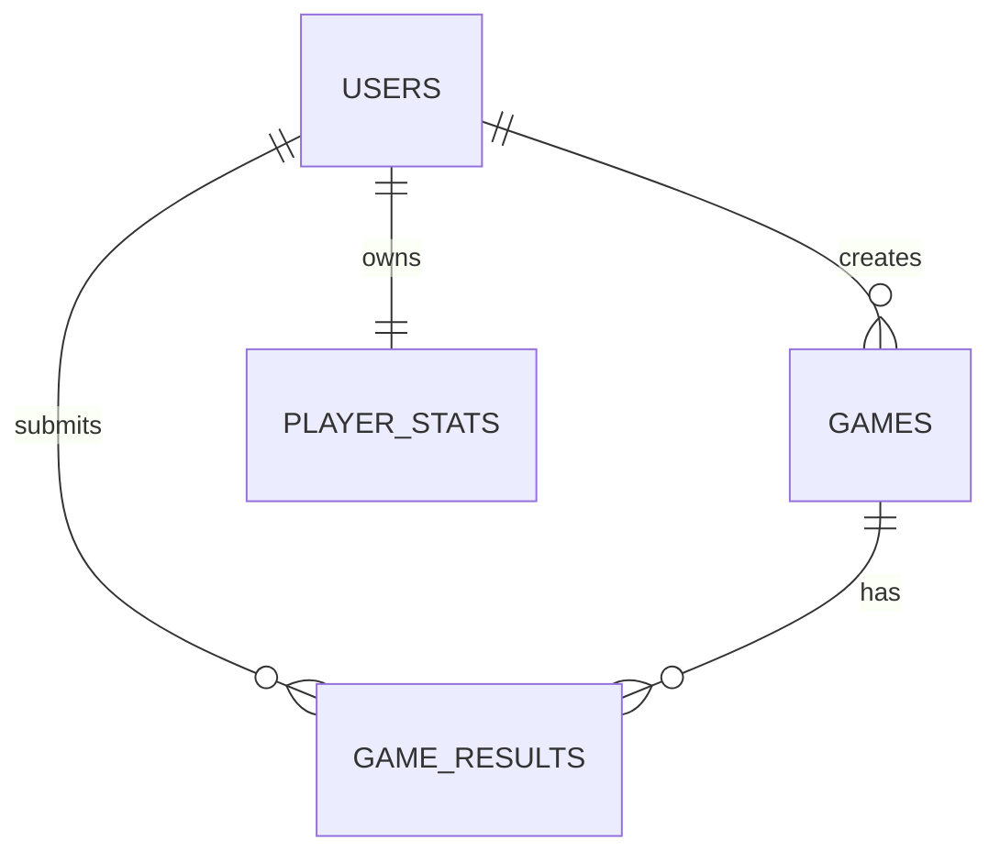

# Projektdokumentation - Fullstackprojekt 1ME326

## 1. Arkitekturbeskrivning

### 1.1 Overgripande arkitektur

Applikationen ar byggd som en klassisk klient-server-losning:

- En frontend som renderas i webblasaren och hanterar interaktioner, spelvy och UI-flode.
- Ett backend-API som ansvarar for autentisering, spelgenerering, resultatlagring och historik.
- En MySQL-databas for persistent lagring av anvandare, spelomgangar och statistik.
- Ett externt API (Mapillary) for att hamta bildinnehall till spelet.

Frontend och backend ar tydligt separerade. Frontend pratar endast med backend via REST-endpoints. Backend pratar i sin tur med databasen och med Mapillary.

### 1.2 Dataflode i systemet

Ett normalt spel-flode:

1. Anvandaren loggar in och far en JWT-token.
2. Frontend skickar `PUT /api/startgame` med Bearer-token.
3. Backend genererar ett `gameId`, hamtar 5 bilder/koordinater fran Mapillary och sparar omgangen i tabellen `games`.
4. Frontend visar bilderna och anvandaren gissar position pa karta.
5. Efter sista rundan skickas resultat till `POST /api/games/{gameId}/result`.
6. Backend validerar spelregler (en gang per anvandare, 1v1-cap) och sparar i `game_results`.
7. Resultat/utgang hamtas via `GET /api/games/{gameId}/results`.
8. Historik hamtas via `GET /api/users/me/games`.

### 1.3 Komponentmodell i frontend

Frontend ar byggd med Web Components for att uppfylla kravet om ramverks/API-baserad UI-hantering och for att undvika ren manuell DOM-styrning.

Exempel pa centrala komponenter:

- `nav-bar` - global navigation och auth-state i UI.
- `game-container` - samordnar spelvyn (street view, karta, submit, delningslank).
- `street-view-image` - hamtar/startar spel och visar bildrundor.
- `open-street-map` - kartinteraktion och gissningskoordinater.
- `game-winner` - resultatsida med vinnarinformation och delning.
- `leader-board` - global ranking.
- `match-history` - personlig historik.

### 1.4 Backendstruktur

Backend ar organiserat med Slim 4 + tjanstelager:

- `public/index.php` - routing, middleware, endpoints.
- `src/Services/AuthService.php` - JWT create/verify.
- `src/Services/UserService.php` - register/login-relaterad DB-logik.
- `src/Services/GameService.php` - spel, resultat, historik, statistik.
- `src/Services/MapillaryService.php` - integration mot externt bild-API.

Denna uppdelning minskar koppling mellan HTTP-lager och affarslogik och gor koden lattare att underhalla.

### 1.5 Arkitekturdiagram

### 1.6 Datamodell (forenklad)

Foljande tabeller anvands i implementationen:

- `users` (id, name, password, ...)
- `games` (game_id, created_by, locations, ...)
- `game_results` (game_id, user_id, score, completed_at, ...)
- `player_stats` (user_id, games_played, wins, win_pct, rating, ...)

Forenklad relation:

## 2. Teknikval och motiveringar

### 2.1 PHP + Slim 4 i backend

Valet av Slim 4 bygger pa:

- Lattviktsramverk med tydlig routing for REST API.
- Enkel integration med middleware (JWT-gate pa skyddade routes).
- Bra balans mellan enkelhet och struktur for kursprojekt.

Alternativ: Laravel hade gett fler inbyggda funktioner men med mer overhead. For projektets storlek var Slim snabbare att etablera och enklare att deploya.

### 2.2 Web Components i frontend

Valet av Web Components ger:

- Modulart UI utan tung frontend-ram.
- Tydlig komponentindelning enligt kravspecifikationen.
- Direkt kontroll over markup och beteende.

Alternativ: React/Vue hade gett mer standardiserad state-hantering, men i detta projekt var Web Components fullt tillrackligt och gav lagre komplexitet i deployment.

### 2.3 Vite + Tailwind

Frontend paketeras och minifieras med Vite, vilket uppfyller tekniskt krav pa build/minifiering. Tailwind anvands for snabb men konsekvent styling.

Alternativ: Ren CSS + manuell bundling var mindre effektivt och gav storre risk for inkonsekvent design.

### 2.4 JWT-baserad auth

JWT valdes for:

- Stateles API-auth med enkel Bearer-header.
- Enkel validering i middleware.
- Tydlig separation mellan publika och skyddade endpoints.

Alternativ: Sessioncookies hade varit mojligt, men JWT passade bra for detta API-upplagg.

### 2.5 Spelmodell och score

Spelet bygger pa total geografisk avvikelse (lagre score ar battre). Det ar enkelt att forsta for anvandare och latt att jamfora i 1v1.

Systemet forhindrar dubbelspel pa samma `gameId` per anvandare. En 1v1-cap finns ocksa i backendlogik, vilket ar forankrat med larare i projektets avgransning.

### 2.6 Felhantering och robusthet

Exempel pa strategier:

- Backend returnerar tydliga statuskoder (`401`, `409`, `404`).
- Frontend hanterar API-fel med anvandarfeedback i vyer.
- Loader-overlay anvands for att signalera laddningstillstand, inklusive spelbildsladdning.

### 2.7 Sakerhetsaspekter

- Losenord hash-as med `password_hash`.
- JWT signeras med hemlig nyckel via `.env`.
- Skyddade endpoints kraver giltig Bearer-token.
- Auth-kontroll gor anvandarbehorighet explicit pa API-niva.

## 3. AI-anvandning

AI-verktyg anvandes aktivt genom hela projektet for att oka hastighet och kvalitet, men all kod har verifierats och justerats manuellt innan integration.

### 3.1 Verktyg

- ChatGPT/Codex for kodforslag, refaktorering, UI-forbattringar och felsokning.
- Linters/build-verktyg for verifiering av att resultatet ar konsistent och byggbart.

### 3.2 Hur AI anvandes i praktiken

- Generera forslag pa komponentstruktur i frontend.
- Forbattra API-floden och felhantering.
- Iterera fram en enhetlig UI-design (navbar, cards, loader, resultatsidor).
- Identifiera edge cases i spel-flode (t.ex. laddningstillstand, 1v1-resultat, duplicerade spel).

### 3.3 Anpassningar och korrigeringar

AI-genererade forslag behovde ofta anpassas:

- Stiljustering for att passa projektets visual language.
- Logikkorrigeringar (ex. loader-state som maste synkas med faktisk bildladdning).
- Forenkling av losningar nar de blev for komplexa for behovet.

### 3.4 Exempel pa prompts (sammanfattade)

- "Can you redesign these cards to match the rest of the theme?"
- "Disable manual swipe and only allow progression through Guess."
- "Show loader until first street-view image is actually loaded."
- "Hide share box on result page once both players have submitted."

### 3.5 Reflektion kring AI-stod

AI var mest vardefullt i iterationer med manga sma UI-beslut och snabb felsokning. Min viktigaste larandeffekt var att bli battre pa att specificera krav tydligt och validera varje forslag mot faktisk funktionalitet.

## 4. Reflektioner och lardomar

### 4.1 Vad som gick bra

- Tydlig uppdelning mellan frontend/backend gjorde projektet hanterbart.
- Delningslank + gemensam spelomgang gav en tydlig "karnfunktion" i produkten.
- Auth och historik blev en bra extra feature som ocksa okade realism i applikationen.
- UI-polish sent i projektet hojde helhetsintrycket utan att bryta core-floden.

### 4.2 Utmaningar

- Externt bild-API innebar variation i svarstid och ibland oforutsagbara svar.
- Deployment/paths mellan lokal miljo och melab kraver noggrann config.
- Loader/async-floden i frontend blev snabbt subtila (race conditions).
- Balans mellan snabb feature-utveckling och strukturell renhet i kodbasen.

### 4.3 Hur utmaningarna lostes

- Miljovariabler och tydlig URL-byggare i frontend (`VITE_API_BASE_URL`).
- Separata serviceklasser i backend for att minska duplicerad kod.
- Iterativ felsokning med snabb build/test-loop efter varje andring.
- Tydlig avgransning av spelregler (1v1) for att undvika scope creep.

### 4.4 Vad jag skulle gora annorlunda

- Tidigare etablera en teststrategi (minst grundlaggande automatiserade tester).
- Dokumentera databas/migrationer mer explicit i separata SQL-filer.
- Dela upp vissa stora UI-komponenter ytterligare for enklare underhall.

### 4.5 Sammanfattande slutsats

Projektet uppfyller kursens grundkrav och centrala extra krav, med en fungerande fullstack-arkitektur, tydlig API-kommunikation och deploymentbar frontend/backend. Det viktigaste jag tar med mig ar hur arkitektur, datamodell och UI-flode hanger ihop i ett verkligt projekt, och hur AI kan anvandas effektivt nar man samtidigt behaller teknisk kontroll och ansvar for resultatet.

---

## Bilaga A - Endpoints

Publika:

- `GET /api/health`
- `POST /api/login`
- `POST /api/register`
- `GET /api/leaderboard`

Skyddade:

- `PUT /api/startgame`
- `GET /api/games/{gameId}`
- `POST /api/games/{gameId}/result`
- `GET /api/games/{gameId}/results`
- `GET /api/users/me/games`

## Bilaga B - Kravtackning (kort)

- Ny spelomgang: uppfyllt
- Externt/dynamiskt innehall: uppfyllt (Mapillary)
- Delbar unik lank: uppfyllt
- Genomfora spelomgang: uppfyllt
- Spara resultat i DB: uppfyllt
- Resultatlista efter omgang: uppfyllt (inom 1v1-upplagg)
- En spelning per anvandare/gameId: uppfyllt
- Extra: auth/inloggning, historik, responsiv design: uppfyllt
