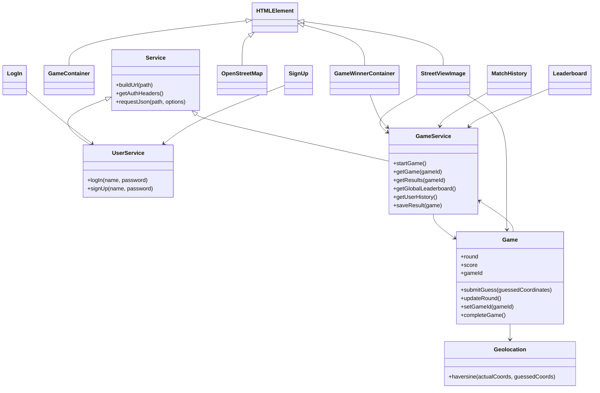
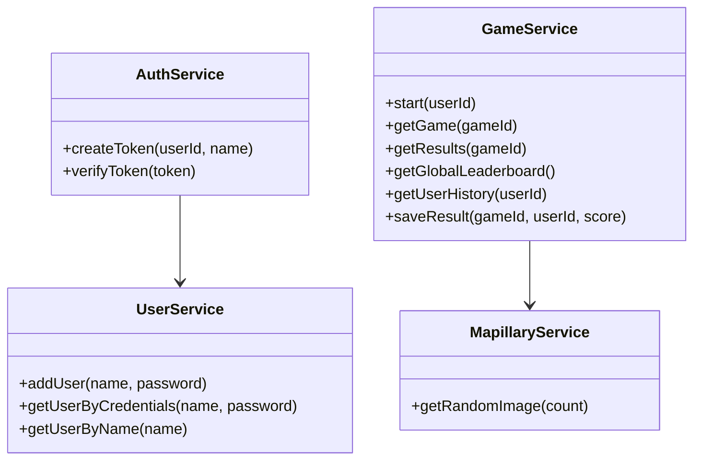
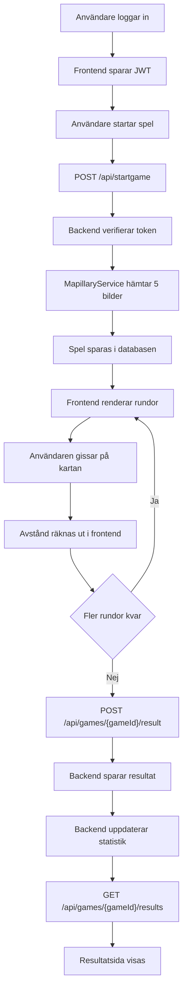

# Fullstackprojekt 1ME326 – GeoGuessr-inspirerat utmaningsspel

## Projektöversikt

Detta projekt är en fullstack-webbapplikation där användare kan utmana varandra i ett geografiskt gissningsspel. En spelare startar en spelomgång, spelar fem rundor och får därefter en unik länk till exakt samma omgång. Länken kan delas med en vän som då spelar med samma bilder och samma förutsättningar. När båda spelarna har genomfört omgången visas en resultatlista där resultaten kan jämföras.

Spelet bygger på gatubilder från ett externt API och kartinteraktion i webbläsaren. Resultatet beräknas som summan av avståndet mellan spelarens gissning och den verkliga platsen. Lägre poäng är bättre.

Projektet uppfyller grundkraven i uppgiften:

- användaren kan skapa en ny spelomgång
- speldata hämtas från ett externt API
- varje spelomgång får en unik delbar länk
- resultat sparas i databasen
- en användare kan bara spela samma spelomgång en gång
- resultatlista visas efter avslutad spelomgång

Projektet uppfyller också flera extrakrav:

- autentisering och inloggning
- personlig historik
- responsiv design för desktop och mobil
- global leaderboard med rating

## Arkitekturbeskrivning

Applikationen är uppdelad i två huvuddelar: ett frontend-projekt i JavaScript och ett backend-projekt i PHP. Frontend körs i webbläsaren och ansvarar för presentation, användarinteraktion och kommunikation med API:t. Backend ansvarar för autentisering, spelgenerering, lagring av resultat och hämtning av statistik.

### Övergripande struktur

```text
Webbläsare
   |
   | HTTP/JSON + Bearer-token
   v
Frontend (Web Components + Vite + Tailwind)
   |
   v
REST API (PHP + Slim 4)
   |
   +--> MySQL / MariaDB
   |
   +--> Mapillary API
```

### UML-diagram

För att göra diagrammet läsbart visar jag här de viktigaste relationerna i stället för att lägga in varje enskild UI-komponent i samma figur. De flesta UI-komponenterna i frontend, till exempel `GameContainer`, `StreetViewImage`, `OpenStreetMap`, `GameWinnerContainer`, `LeaderboardContainer`, `MatchHistoryContainer`, `LogInContainer`, `SignUpContainer`, `NavBar`, `PageLoader` och `Index`, är Web Components och ärver från `HTMLElement`.

#### Frontend



#### Backend



### Flödesdiagram



### Dataflöde

Ett typiskt flöde när en användare startar en spelomgång ser ut så här:

1. Användaren loggar in eller registrerar ett konto.
2. Frontend skickar en förfrågan till `POST /api/startgame`.
3. Backend verifierar JWT-token och anropar `MapillaryService`.
4. `MapillaryService` hämtar fem slumpmässiga gatubilder från Mapillary inom utvalda geografiska områden.
5. Backend sparar spelomgången i databasen med ett unikt `gameId` och lagrar bilddata och koordinater.
6. Frontend får tillbaka `gameId` och bilddata och renderar spelet.
7. För varje runda placerar användaren en markör på kartan.
8. Frontend räknar ut avståndet med Haversine-formeln och summerar spelarens totalpoäng.
9. När alla rundor är klara skickas resultatet till `POST /api/games/{gameId}/result`.
10. Backend sparar resultatet, kontrollerar att användaren inte redan spelat samma omgång och uppdaterar spelarstatistik.
11. Resultatsidan hämtar topplistan via `GET /api/games/{gameId}/results`.

### Komponenter och ansvar

Frontend är uppdelad i återanvändbara Web Components. Exempel:

- `game-container`: styr spelvyn och rundflödet
- `street-view-image`: laddar och visar spelbilderna
- `open-street-map`: hanterar kartan och spelarens gissningar
- `game-winner`: visar resultat för en spelomgång
- `leader-board`: visar global leaderboard
- `match-history`: visar spelarens historik

Backend är uppdelad i tjänster:

- `AuthService`: skapar och verifierar JWT-token
- `UserService`: hanterar användare och lösenord
- `GameService`: skapar spel, sparar resultat och hämtar historik samt leaderboard
- `MapillaryService`: integrerar mot det externa bild-API:t

### Databasmodell

Datamodellen bygger i huvudsak på tre typer av information:

- användare
- spelomgångar
- spelresultat och statistik

Förenklat innehåller databasen tabeller för:

- `users`: användarkonton
- `games`: spelomgångar med genererad platsdata
- `game_results`: en rad per spelares genomförda försök
- `player_stats`: aggregerad statistik som vinster, matcher och rating

Relationerna är relativt raka: en användare kan ha många resultat, en spelomgång kan ha upp till två resultat, och statistik sammanställs per användare.

## Teknikval och motiveringar

### Backend: PHP med Slim 4

Jag valde PHP med Slim 4 som backend-ramverk. Kravet i uppgiften var att använda PHP med ett befintligt ramverk, och Slim passade bra eftersom projektet främst behövde routing, middleware och JSON-svar. Alternativet hade varit ett större ramverk som Laravel, men det hade gett mer inbyggd funktionalitet än projektet faktiskt behövde. För ett mindre spel-API var Slim enklare att förstå och lättare att hålla strukturerat.

### Frontend: Web Components

I frontend valde jag Web Components i stället för React eller Vue. Anledningen var att uppgiften krävde någon form av UI-ramverk eller API, men inte nödvändigtvis ett tungt frontendbibliotek. Web Components gav en tydlig komponentindelning utan extra runtime-beroenden. Nackdelen är att state-hanteringen blir mer manuell än i React, men i den här applikationens storlek fungerade det bra.

### Byggkedja: Vite och Tailwind

Frontend paketeras med Vite. Det ger snabb utvecklingsserver, enkel multipage-konfiguration och minifierad produktionsbuild. Tailwind användes för att bygga ett konsekvent och responsivt gränssnitt snabbt. Ett alternativ hade varit vanlig CSS eller Bootstrap, men Tailwind gav bättre kontroll över layout och komponentstil utan att låsa designen till ett färdigt system.

### Databasåtkomst: PDO

På backend används PDO direkt i stället för ett ORM. Jag valde detta för att datamodellen är liten och frågorna är relativt enkla. Ett ORM hade kunnat minska mängden SQL i vissa delar, men hade också ökat abstraktionsnivån. Med PDO blev det tydligt exakt vad som sparas och hämtas.

### Autentisering: JWT

För autentisering används JWT i stället för PHP-sessioner. Eftersom frontend och backend är frikopplade och kommunicerar via REST passade stateless autentisering bättre. Frontend skickar en Bearer-token till skyddade endpoints. En nackdel är att token lagras i `localStorage`, vilket kräver att resten av klientkoden är försiktig med XSS-risker. För ett kursprojekt var detta en rimlig kompromiss, men i en större applikation hade jag övervägt en säkrare cookie-baserad lösning.

### Externa tjänster: Mapillary och OpenStreetMap

För spelinnehållet används Mapillary. Det uppfyller kravet på externt API och gör att spelet kan generera många omgångar utan att innehållet tar slut. För kartan används Leaflet med OpenStreetMap. Det var ett naturligt val eftersom det är gratis, väl dokumenterat och fungerar bra i webbläsaren utan egen API-nyckel.

### Resultatmodell och rating

Utöver den lokala resultatlistan för varje omgång lade jag till global statistik och en enkel ratingmodell. Den är inte en full Elo-implementation, men fungerar som långsiktig progression. Alternativet hade varit att bara spara råa matchresultat, men rating och historik gör applikationen mer spelbar över tid och uppfyller extrakraven bättre.

### Felhantering och underhållbarhet

Under projektet blev det tydligt att återanvändbar felhantering var viktig. Därför samlades frontendens fetch-logik i en gemensam tjänst för att minska duplicerad kod och få konsekventa felmeddelanden. På backend separerades logik i serviceklasser i stället för att lägga allt direkt i route handlers. Det gör projektet lättare att felsöka och vidareutveckla.

## AI-användning

Jag använde generativa AI-verktyg aktivt i projektet, främst som stöd för implementation, felsökning och refaktorering. Verktygen användes inte som ersättning för förståelse, utan som ett sätt att snabbare komma fram till lösningar som sedan behövde granskas och anpassas.

### Verktyg

- Claude användes mycket under projektet, särskilt för kodgenerering, felsökning, omstrukturering och snabb iterativ utveckling
- ChatGPT och Codex användes också för kodförslag, refaktorering och buggrättning

### Vad AI användes till

- generera första versioner av UI-komponenter
- hjälpa till att strukturera Slim-backend och tjänsteklasser
- föreslå integration mot Mapillary API
- hjälpa till med JWT-autentisering
- hitta och rätta buggar i resultatflöden och formulär
- städa upp redundant kod och centralisera API-anrop
- föreslå förbättringar i README, arkitekturbeskrivning och teknisk dokumentation

### Anpassningar och korrigeringar

AI-genererad kod behövde nästan alltid justeras. Exempel:

- vissa komponenter innehöll onödig boilerplate
- felhantering var ibland för svag eller inkonsekvent
- UI-texter och tillstånd var ibland logiskt felaktiga
- vissa lösningar blev mer komplexa än nödvändigt och behövde förenklas

Ett konkret exempel var resultatsidan där en spelare som redan spelat fortfarande kunde visas som `waiting`. Där behövde logiken ändras manuellt så att faktisk poäng visades när ett resultat redan fanns sparat.

### Reflektion kring AI

Det som fungerade bäst var att använda AI för avgränsade delproblem, till exempel "skriv en service som hämtar data från ett API" eller "hjälp mig hitta varför det här UI-tillståndet blir fel". Det som fungerade sämre var när AI fick för öppna uppgifter, eftersom svaret då ofta blev mer generiskt eller överbyggt än projektet behövde.

Claude var särskilt användbart när jag ville arbeta snabbt i flera små iterationer: först få fram ett fungerande förslag, sedan granska det, testa det och be om en mindre förbättring i nästa steg. Det passade bra ihop med ett agilt arbetssätt där applikationen skulle vara körbar under hela utvecklingsperioden.

## Reflektioner och lärdomar

Det som gick bäst i projektet var den iterativa utvecklingen. Genom att hålla projektet körbart under hela processen blev det enklare att testa nya delar utan att allt annat föll sönder. Kombinationen av en liten backendstruktur och komponentbaserad frontend gjorde också att det gick att lägga till funktioner stegvis.

Den största tekniska utmaningen var integrationen mot externa data. Mapillary gav inte alltid jämnt resultat beroende på område, så spelinnehållet behövde genereras från utvalda geografiska platser där täckningen var bättre. En annan utmaning var att hålla spelreglerna konsekventa, särskilt att samma användare inte ska kunna spela samma länk flera gånger och att en match bara ska acceptera två spelare.

Om jag skulle göra om projektet hade jag lagt mer tid tidigt på dokumenterad databasdesign och teststrategi. Jag hade också infört striktare kvalitetskontroller tidigare, till exempel linting och tydligare gemensamma hjälpfunktioner i frontend, eftersom flera buggar i efterhand visade sig bero på duplicerad logik.

AI påverkade arbetssättet tydligt. Jag kunde arbeta snabbare och ta mig an fler delar av applikationen, men det flyttade också fokus från att skriva varje rad själv till att granska, förstå och förbättra kodförslag. Det gjorde kvalitetsgranskning viktigare än i mindre projekt utan AI.

## Körning lokalt

### Frontend

```bash
cd geoGuessr_frontend
npm install
npm run dev
```

Produktionsbuild:

```bash
npm run build
```

### Backend

1. Konfigurera `geoGuessr_backend/.env`
2. Säkerställ att Composer-beroenden finns installerade
3. Peka webbserverns document root mot `geoGuessr_backend/public`

## API-översikt

Publika endpoints:

- `POST /api/login`
- `POST /api/register`
- `GET /api/leaderboard`

Skyddade endpoints:

- `POST /api/startgame`
- `GET /api/games/{gameId}`
- `POST /api/games/{gameId}/result`
- `GET /api/games/{gameId}/results`
- `GET /api/users/me/games`
